
People have long dreamed of creating machines that can think and decide for themselves. There have been countless Sci-Fi books and movies that exploit (and sometimes over hype) the term "Artificial Intelligence". This peculiar trait of the human mind — to imagine something well before it comes into existence — has itself led to many inventions and discoveries. Just a decade ago, the research on Artificial Intelligence was limited to only a few candidates pursuing higher degrees in Universities or big companies. The increase in computational power and data availability over the past few years, however, has made it possible for anyone with a decent computer to get started with Machine Learning (ML) and Artificial Intelligence (AI). This blog discusses one such personal project that I started working on almost a year ago. The project tries to use state-of-the-art methods in the deep reinforcement learning paradigm to master the traditional Nepali board game of Bagh Chal through self-play.

Instead of diving straight into the project, I want to take some time to introduce Artificial Intelligence and some of its relevant concepts. If you would like to skip these upcoming sections, directly refer to the <a href="#baghchal_ai">Bagh Chal AI Project</a> section.

***

<h2 id="renaissance-of-artificial-intelligence">Renaissance of Artificial Intelligence</h2>
When programmable computers were first created, they rapidly overtook humans in solving problems that could be described by a list of formal mathematical rules, such as crunching numbers. The main obstacle to computers and artificial intelligence proved to be the tasks that are easy for human beings but difficult to formalize as a set of mathematical rules. The tasks such as recognizing spoken words or differentiating objects in images require intuition and do not translate to simple mathematical rules.

We generally do not give our brain enough credit and are unaware of the extent to which our intuition plays a role in our everyday thinking process. To that, I want to start the blog with a perfect example that Andrej Karpathy gave in his <a target="_blank" href="https://karpathy.github.io/2012/10/22/state-of-computer-vision/">blog</a> back in 2012 that holds to this day.

<figure><figcaption>A funny picture</figcaption></figure>

The above picture is funny.

What does your brain go through within fractions of seconds to comprehend this image? What would it take for a computer to understand this image as you do?
<ul><li>You recognize it is an image of a bunch of people in a hallway.</li><li>You recognize that there are 3 mirrors, so some are “fake” replicas of people from different viewpoints.</li><li>You recognize Obama from the few pixels that make up his face.</li><li>You recognize from a few pixels and the posture of the man that he is standing on a scale.</li><li>You recognize that Obama has his foot on top of the scale (3D viewpoint) from a 2D image.</li><li>You know how physics works: pressing on the scale applies force to it and will hence over-estimate the weight of the person.</li><li>You deduce from the person's pose that he is unaware of this and further infer how the scene is about to unfold. He might be confused after seeing that the reading exceeds his expectations.</li><li>You perceive the state of mind of people in the back and their view of the state of mind of the person. You understand why they find the person's imminent confusion funny.</li><li>The fact that the perpetrator here was the president maybe makes it even funnier. You understand that people in his position aren't usually expected to undertake these actions.</li></ul>
This list could go on and on. The mind-boggling fact is that you make all these inferences just by a glance at a 2D array of RGB values. Meanwhile, even the strongest of the supercomputers would not even come close to achieving this feat using today's state-of-the-art techniques in Computer Vision.

For the sake of this blog, let's start with something much simpler. Imagine that you are given a task to identify handwritten digits in a 28x28 image. How would you go about solving this problem? It might sound ridiculously easy at the start considering that even a small child introduced to numbers can get this correct almost every time. Even though this example is used as the typical "Hello, World!" program for people getting into Artificial Intelligence (especially deep learning), the solution to this problem is not as trivial as it first seems.

One obvious and non-machine learning approach would be to use handcrafted rules and heuristics on the shape of strokes to distinguish the digits. However, due to the variability of handwriting, it leads to a proliferation of rules and exceptions giving poor results. Some sample variants of the handwritten digits are shown in the following image.

<figure><figcaption>Sample Handwritten Digits From MNIST Dataset</figcaption></figure>
So, how would we tackle this problem the ML/AI way?

Before we start talking about how to solve this problem, let's first understand how ML/AI differs from the plain old definitive programmatic or algorithmic approach. Machine learning refers to the concept that allows computers to learn from examples or experiences rather than being explicitly programmed.

Basically, we trade-off the hard-coded rules in the program for massive amounts of data. Mathematical tools in linear algebra, calculus, and statistics are cleverly used to find patterns in the data and construct a model that is then used for prediction. A training process occurs where the model is improved iteratively by evaluating the quality of its prediction. Over time, the model learns to correctly predict over the data that it has never seen before.

For instance, instead of using handcrafted rules to identify handwritten digits, we can show the computer a bunch of examples of how each digit looks like. It then creates a model that learns from all these example data and over time learns to generalize the shape of each digit.

Creating a model, evaluating the performance of the model, and improving the model is a topic for another blog. However, let's have a quick glance at the sub-fields of machine learning.

<h2 id="the-sub-fields-of-machine-learning">The Sub-Fields of Machine Learning</h2><h3 id="supervised-learning">Supervised Learning</h3>
Supervised learning is a type of machine learning in which the learning is done from the data having input and output pairs. The goal is to create a model that learns to map from the input values to the output.

It is called supervised learning because we know beforehand what the correct answers are. The goal of the machine learning algorithm is to learn the relationship between each input value to the output value by training on a given dataset. In doing so, the model should neither prioritize specific training data nor generalize too much. To avoid this, a larger training dataset is preferred and the model is tested using input values that the model has never seen before (test dataset).

This is better understood with an example. Suppose you're given the following dataset:

<table>
<tr>
<td>x</td>
<td>0</td>
<td>2</td>
<td>3</td>
<td>4</td>
</tr>
<tr>
<td>y</td>
<td>0</td>
<td>4</td>
<td>9</td>
<td>16</td>
</tr>
</table>

Let's put your admirable brain to use, shall we? Can you construct a mental model to find the function that maps <strong>x</strong> to <strong>y</strong>?

After quick speculation, you might have stumbled upon the function <strong>y = x2</strong> that fits the dataset perfectly.

Now let's see how our hunch would have changed if we had access to only a portion of the dataset:

<table>
<tr>
<td>x</td>
<td>0</td>
<td>2</td>
</tr>
<tr>
<td>y</td>
<td>0</td>
<td>4</td>
</tr>
</table>

Here, both <strong>y = 2x</strong> and <strong>y = x2</strong> are equally plausible answers. But we know that the actual answer is <strong>y = x2</strong>, and <strong>y = 2x</strong> is considered to be the underfit model due to less training samples. Our model would predict <strong>y = 6</strong> for <strong>x = 3</strong> while the actual answer is <strong>y = 9</strong>.

Let's look at some visualizations to clearly understand these concepts.

<figure>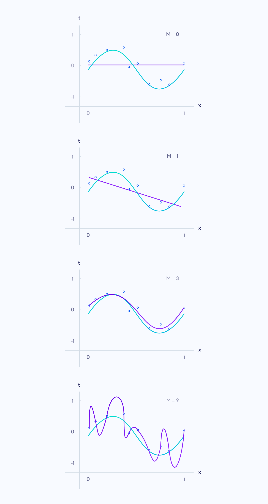<figcaption>Polynomial Curve Fitting</figcaption></figure>

Here, the blue line shows the actual function and the purple line shows the prediction of the model. The blue circles represent the training set.

We can see that the last model correctly predicts all the training data (all points pass through the purple line). However, this model is said to be an overfit model (too specific to the training set) and it performs badly on the test set. Similarly, the first two models are said to be underfit models (too much generalization).

The third model is the best among these models even though it has a lesser accuracy than the overfitted model. The model can further be improved by using more training data as shown below.

<figure>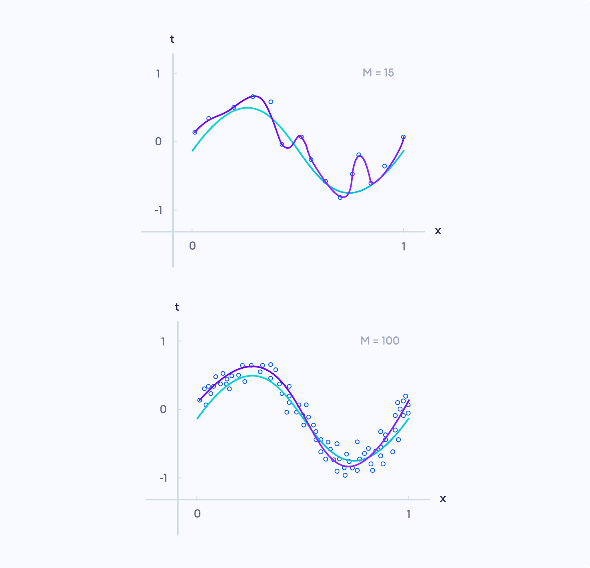<figcaption>Less Training Data vs More Training Data</figcaption></figure>

Supervised learning can further be divided into classification and regression.

Classification problems are related to making probabilistic estimates on classifying the input data into one of many categories. Identifying handwritten digits falls under this category.

Regression problems are related to predicting real value output in continuous output space. The above problem of finding the best-fit polynomial to predict output to its other input values falls under this category.

To learn more about supervised learning, visit <a target="_blank" href="https://towardsdatascience.com/a-brief-introduction-to-supervised-learning-54a3e3932590">Introduction to Supervised Learning</a>.

<h3 id="unsupervised-learning">Unsupervised Learning</h3>
Unsupervised learning is a type of machine learning in which the learning algorithm does not have any labels. Instead, the goal of unsupervised learning is to find the hidden structure in the input data itself and learn its features.

Some types of unsupervised learning include clustering, dimensionality reduction, and generative models.

Clustering is the method by which the input data is organized into clusters based on the similarity on some of their features and their dissimilarity with other clusters, despite having no labels.

<figure>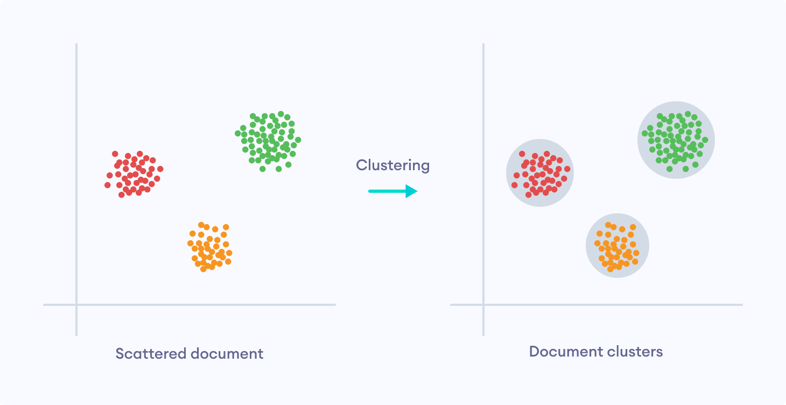<figcaption>Clustering in Unsupervised Learning</figcaption></figure>

Dimensionality reduction is used to convert a set of data in higher dimensions to lower dimensions. They can remove redundant data and only preserve the most important features. This pre-processing technique can reduce a lot of computational expenses and make the model run a lot faster.

The new unsupervised deep learning field has given rise to autoencoders. Autoencoders use deep neural networks to map input data back to themselves. The twist is that the model has a bottleneck as a hidden layer. So, it learns to represent the input in a smaller amount of data (compressed form).

<figure>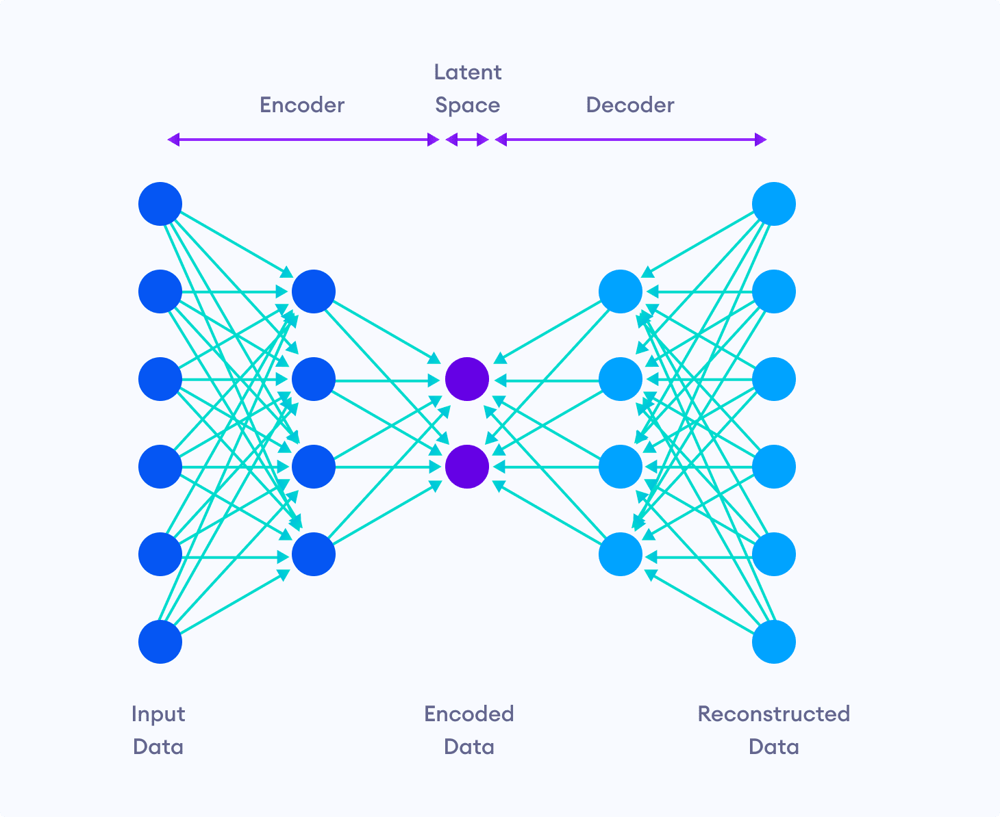<figcaption>Neural Network Architecture of Autoencoders</figcaption></figure>

Generative modeling is a task that involves learning the regularity or patterns in the input data so that the model can generate output samples similar to the input dataset.

Since my project does not use unsupervised learning, we won't go into its details in this blog. Check out the following to learn more about unsupervised learning:
<ul><li><a target="_blank" href="https://medium.com/machine-learning-for-humans/unsupervised-learning-f45587588294">Machine Learning For Humans – Unsupervised Learning</a></li><li><a target="_blank" href="https://towardsdatascience.com/unsupervised-learning-and-data-clustering-eeecb78b422a">Unsupervised Learning and Data Clustering</a></li><li><a target="_blank" href="https://openai.com/blog/generative-models/">Generative Models</a></li></ul>

<h3 id="reinforcement-learning">Reinforcement Learning</h3>
Reinforcement Learning (RL) is the type of Machine Learning where an agent learns how to map situations to actions so as to maximize a numerical reward signal from the environment.

The typical examples where RL is used are:
<ul><li>Defeat the world champion at Go</li><li>Make a humanoid robot walk</li><li>Play different Atari games better than humans</li><li>Fly stunt maneuvers in a helicopter</li></ul>
It also is the main component of my AI project that we later are going to discuss.

<strong>So what makes reinforcement learning different?</strong>
<ul><li>There is no supervisor, only a reward signal</li><li>Feedback may be delayed and not instantaneous</li><li>Agent’s actions affect the subsequent data it receives</li></ul>

At any time step, the agent in state <strong>S1</strong> takes an action <strong>A1</strong>. Based on this action, the environment provides the agent with reward <strong>R1</strong> and a new state <strong>S2</strong>.

<figure>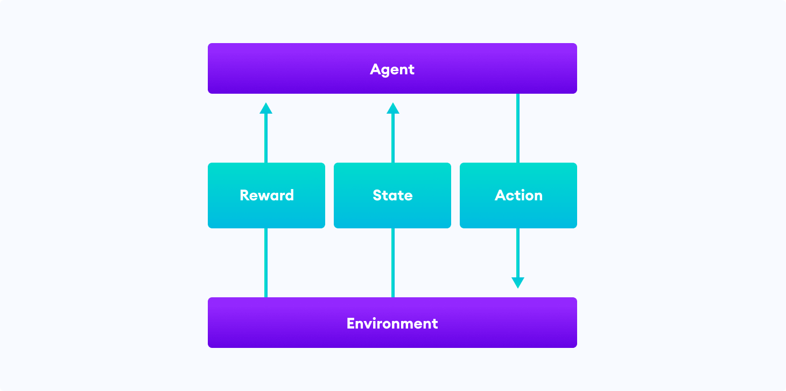<figcaption>The typical framing of a Reinforcement Learning (RL) scenario</figcaption></figure>

A reward is a scalar feedback signal which indicates how well an agent is doing. The agent's goal is to maximize the reward signal. For instance, in the example of flying stunt maneuvers in a helicopter,

<ol><li>A positive reward may be given for following the desired trajectory.</li><li>A negative reward may be given for crashing.</li></ol>

<strong>Major Components of an RL Agent</strong>

<ul><li><strong>Policy</strong>: A function that defines the behavior of the agent.</li><li><strong>Value function</strong>: The agent's understanding of how good each state and/or action is.</li><li><strong>Model</strong>: The agent’s representation of the environment.</li></ul>

What makes the reinforcement learning problem so much harder is that the agent will initially be clueless about how good or bad its actions are. Sometimes, even the environment might be only partially observable. The agent has to perform hit and trial until it starts discovering patterns and strategies.

Moreover, the agent cannot act greedily on the reward signal. The agent has to learn to <strong>maximize the reward signal in the long term</strong>. So, sometimes the agent must be willing to give up some reward so as to gain more rewards in the long run. One such example would be to sacrifice a piece in chess to gain a positional or tactical advantage.

The <strong>exploration vs exploitation</strong> trade-off is the central problem in RL where the agent with incomplete knowledge about the environment has to decide whether to use strategies that have worked well so far (exploitation) or to make uncertain novel decisions (exploration) in hopes to gain more reward. To learn more about Exploration vs Exploitation and some solutions, visit <a target="_blank" href="https://towardsdatascience.com/intuition-exploration-vs-exploitation-c645a1d37c7a">Intuition: Exploration vs Exploitation</a>.

Some classical solutions to the reinforcement learning problem are Dynamic Programming, Monte Carlo Methods, and Temporal-difference learning. You can visit <a target="_blank" href="https://youtu.be/2pWv7GOvuf0">RL Course by David Silver</a> to learn more about reinforcement learning problems and solutions.

David Silver was the lead researcher on <a target="_blank" href="https://deepmind.com/research/case-studies/alphago-the-story-so-far">AlphaGo</a> and <a target="_blank" href="https://deepmind.com/blog/article/alphazero-shedding-new-light-grand-games-chess-shogi-and-go">AlphaZero</a>.

AlphaGo was the first computer program to beat a professional human Go player and the first to defeat a Go world champion. It was first trained on professional human games and then learned to improve by itself. To learn more, read the <a target="_blank" href="https://vk.com/doc-44016343_437229031?dl=56ce06e325d42fbc72">AlphaGo Research Paper</a>.

AlphaZero was an improved and more general version of AlphaGo that learned to play Go, Chess and Shogi without any human knowledge. It surpassed its predecessor and defeated AlphaGo <strong>100-0</strong> in 100 games of Go. To learn more, read the <a target="_blank" href="https://arxiv.org/pdf/1712.01815.pdf">AlphaZero Research Paper</a>. My self-learning AI project is also inspired very closely by AlphaZero.

<h3 id="deep-learning">Deep Learning</h3>

Numerous artificial intelligence projects have tried to hard-code knowledge about the world in formal languages. This approach is known as the <strong>knowledge base approach</strong> to AI. However, none of these projects have led to major breakthroughs.

Then, machine learning was introduced so that the AI systems could acquire their own knowledge from the data. The performance of these simple machine learning algorithms depends heavily on the representation of the data and the use of important features.

Imagine that we have developed a <strong>logistic regression model</strong> (regression for binary data such as True or False) to detect Diabetic Retinopathy (diabetes complication that affects eyes). To use this model, a doctor has to <strong>manually</strong> observe the retina image and put relevant pieces of information into the model, such as the number and type of retinal lesions (damaged regions) and where they appear in the image.

<figure><figcaption>Retina Image of a Person with Diabetic Retinopathy</figcaption></figure>

If the model was directly given the retina image as shown above, rather than the formalized report from the doctor, it would not be able to make predictions. It is because the individual pixels of the retina image have a negligible correlation with the presence or absence of Diabetic Retinopathy.

Let's look at one more example where the representation of the data plays an important role in the performance of the ML model.

<figure>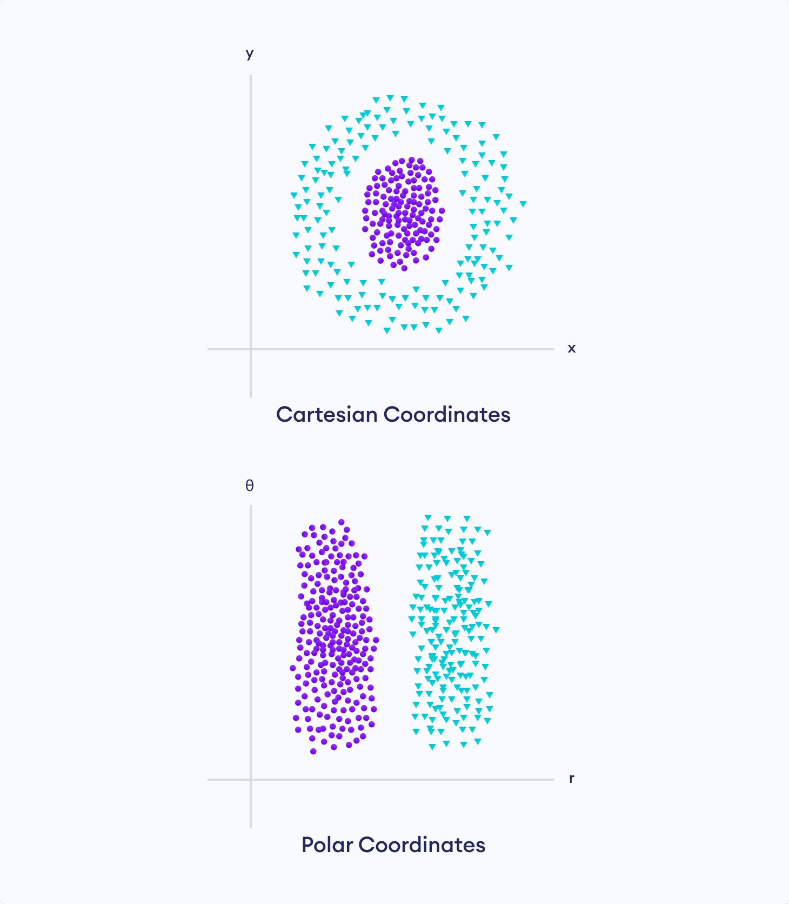<figcaption>Representation of data in Cartesian vs Polar coordinates</figcaption></figure>

Here, it is impossible to separate the two sets of data in cartesian coordinates with a linear model. However, just changing the representation of data to polar coordinates makes this task an easy one.

For many tasks, it is actually very difficult to know what features should be extracted. Suppose we want to write a program that detects cars in images. Since cars have wheels, we might like to use their presence as a feature. However, it is embarrassingly difficult to describe wheels in terms of pixel values. Even though wheels have simple geometric shapes, the real-life images of wheels are complicated by shadows, glaring sunlight, masking of the wheels by other objects, and so on.

One solution to the problem of finding the right feature is <strong>representation learning</strong>. In this approach, the human intervention is further reduced by replacing the hand-designed features with learned representations by the model itself.

In other words, the model not only learns the mapping from features to the output but also <strong>learns to choose the right features</strong> from the raw data.

Whenever we go from one technique to another, we substitute one problem for another one. Now, the major challenge in representation learning is to find a way for the model to learn the features by itself. However, it is very difficult to extract high level, abstract features from raw data directly. This is where deep learning comes to the rescue.

Deep Learning is a type of representation learning where the <strong>representations are expressed in terms of other simpler representations</strong>. This allows the computer to build complex features from simpler features.

<figure>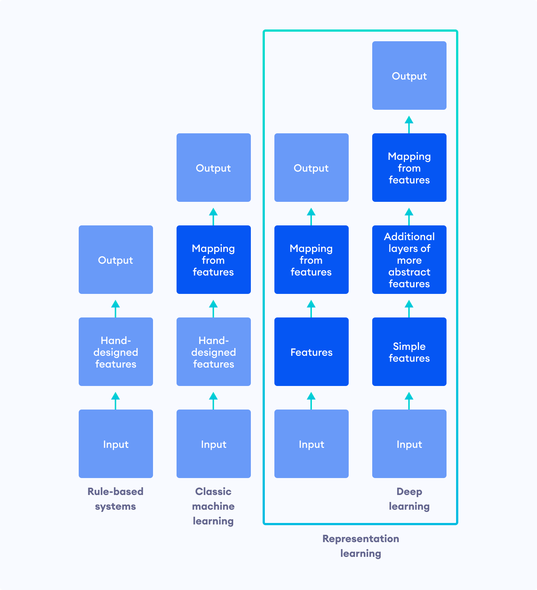<figcaption>Difference between Rule-based, Classical ML, and Representation Learning Systems</figcaption></figure>

The quintessential example of a deep learning model is the multilayer perceptron that maps the input to the output. Let's look at an illustration of how a deep learning model learns to recognize complex patterns by building upon simpler concepts in the data.

<figure>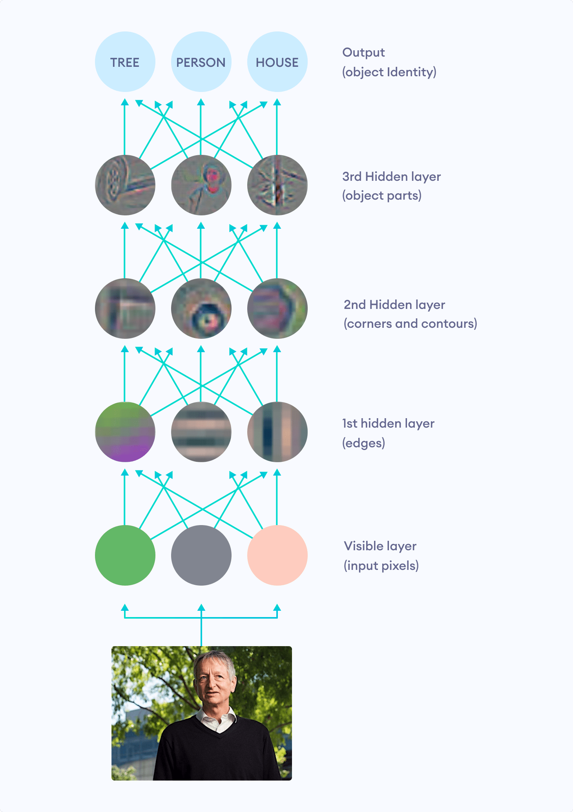<figcaption>Illustration of how deep neural networks build complex representations from simpler ones</figcaption></figure>

Even though each pixel value of the image has no correlation with identifying the object in the image, the deep learning model builds a hierarchical structure to learn representations. It first learns to detect edges that makeup corners and contours which in turn gives rise to the object parts. These object parts are then finally able to detect the object in the image.

The examples above are inspired by the ones in the Deep Learning book by Ian Goodfellow, Yoshua Bengio, and Aaron Courville. Visit <a target="_blank" href="https://www.deeplearningbook.org/">Deep Learning Book Website</a> to read a free online version of the book. It is an excellent material to get started with Deep Learning.

<h2>Project Alpha BaghChal?</h2>

<h3 id="the-motivation-behind-the-project"><strong>The motivation behind the project</strong></h3>

Back in the summer of 2017, I had a few months break before starting my junior year in high school. At that point, I was not new to programming but I barely had any idea about Artificial intelligence (AI). I wanted to understand how chess engines like <a target="_blank" href="https://stockfishchess.org/">Stockfish</a> (not an AI engine) work, but soon found myself in AI territory once I heard about AlphaZero. That instantly got me into ML/AI and I spent almost two years starting from scratch and working on smaller projects.

Inspired by AlphaZero, I thought of making a chess engine but the complexity of the game and the amount of training it would require set me back even before I got started. During my senior year, I tried making a similar engine as a science fair project but for a much simpler game of Bagh Chal. Even then, I had underestimated the difficulty of the project and the time scramble led to the project failure without yielding any results. I stopped working on it for a while until I finished high school and gave it another shot. 

Before discussing how reinforcement learning and deep learning was used in the agent's architecture, let's first acquaint ourselves with the game of Bagh Chal. In the upcoming sections, I will also discuss how I built a game library and introduced game notations to record the moves for this traditional and somewhat obsolete game.

<h2 id="bagh-chal">Bagh Chal</h2>

Bagh Chal is one of the many variants of the tiger hunting board games played locally in South East Asia and the Indian subcontinent. This ancient Nepali game shares many resemblances to other traditional games like Komikan, Rimau, and Adugo in terms of board structure and player objectives.

The strategic, two-player board game is played on a 5x5 grid. The pieces are positioned at the intersection of the lines where adjacent lines from the intersection define the legal moves for a piece.

<figure><figcaption>The initial board configuration for Bagh Chal where the tigers are placed at the four vertices of a 5x5 grid and 20 goats are outside the board.</figcaption></figure>

<h3 id="game-rules">Game Rules</h3>

The game completes in two phases:

<ol><li><strong>Goat Placement phase</strong> During the placement phase, twenty goats are placed one after the other in one of the empty slots on the board while tigers move around. Goats are not allowed to move until all goats have been placed.</li><li><strong>Goat Movement phase</strong> The movement phase continues with both players moving their corresponding pieces.</li></ol>
Pieces can move from their corresponding slot to other empty slots along the grid lines.

<figure>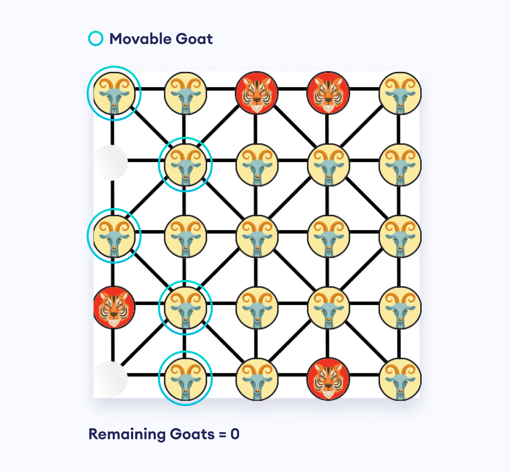<figcaption>The Moveable Goats can jump along the grid-lines to an empty slot.</figcaption></figure>

Throughout the game, tigers also have a special <strong>Capture</strong> move, where they can jump over a goat along the grid lines to an empty slot, thereby removing the goat from the board.

<figure>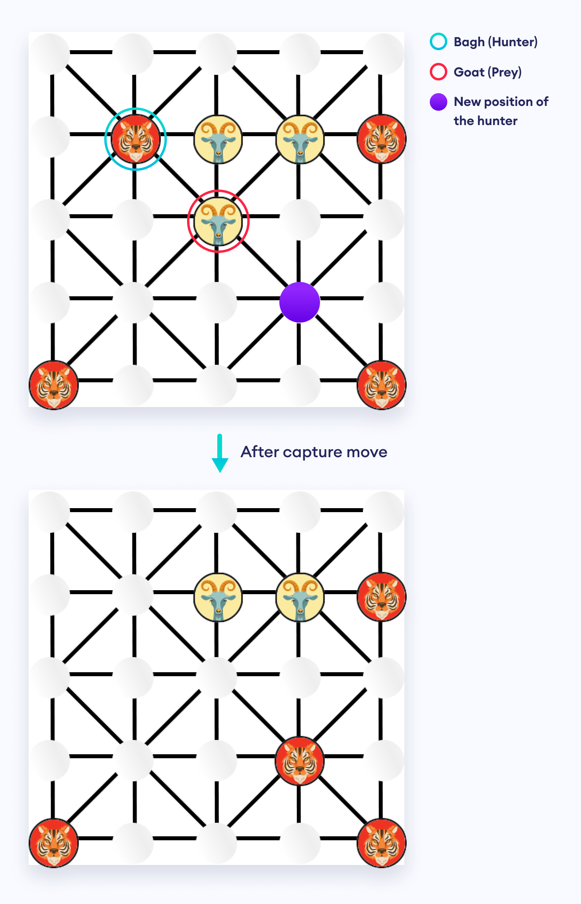<figcaption>The Tigers can jump over a Goat to capture it.</figcaption></figure>

This asymmetric game proceeds with tigers trying to capture goats and goats trying to trap tigers (without any legal moves). The game is over when either the tigers capture five goats or the goats have blocked the legal moves for all tigers. In some rare cases, tigers can also win by blocking all the legal moves for goats.

<figure>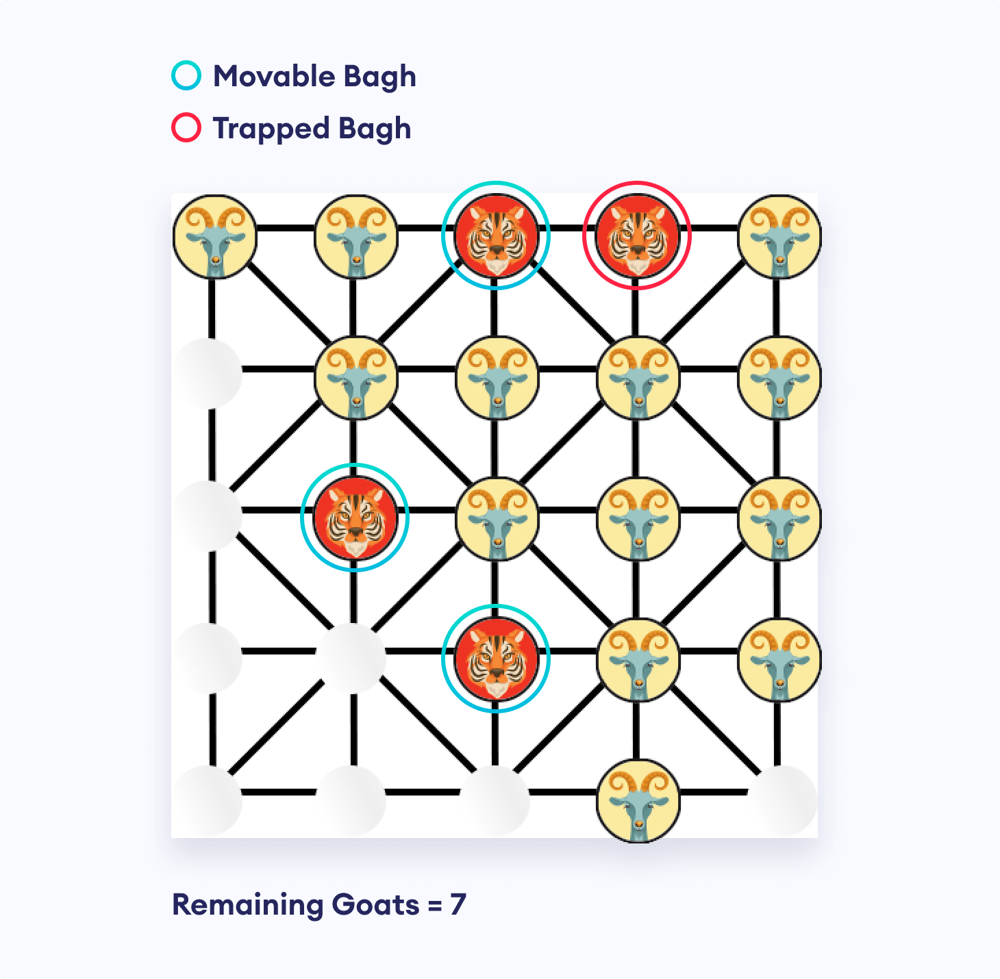<figcaption>Moveable Tigers and Trapped Tigers in Bagh Chal</figcaption></figure>

<h3 id="ambiguous-rules">Ambiguous Rules</h3>

The game can fall into a cycle of repeating board positions during the gameplay. To deal with these perpetual move orders that goats can employ to defend themselves from being captured, some communities have introduced constraints that do not allow moves that revert the game position to one that has already occurred in the game.

However, this restriction can sometimes prevent moves that are forced for bagh players or cause goats to make absurd sacrifices. The board positions are bound to reoccur in lengthy games where there have been no capture moves for a long time. Thus, declaring a winner on that basis is highly ambiguous.

For this project, this rule has been overridden by the standard "draw by threefold repetition" rule, where the recurrence of the same board position for three times automatically leads to a draw. The rule is rational as the recurrence of board position implies that no progress is being made in the game.

<h3 id="creating-bagh-chal-library-game-environment-">Creating Bagh Chal library (Game Environment)</h3>

Before working on the AI project, I had to prepare a Python Bagh Chal library to use the logic of the game and keep records of the board game states.

<strong>baghchal</strong> is a pure Python Bagh Chal library that supports game import, move generation, move validation, and board image rendering. It also comes with a simple engine based on the minimax algorithm and alpha-beta pruning.

Visit the <a target="_blank" href="https://github.com/basnetsoyuj/baghchal">GitHub baghchal Repository</a> to learn more about this library.

<h3 id="introducing-game-notation">Introducing Game Notation</h3>

Since Bagh Chal is a traditional Nepali board game, there was no recorded game dataset nor was there any way to keep track of the game moves.

So, I used two notations to record Bagh Chal games: <strong>PGN</strong> and <strong>FEN</strong>.

Portable Game Notation (PGN) is inspired by the game of chess. This notation consists of a full move history of the game, along with other information. The algebraic notation used makes PGN easier for humans to read and write, and for computer programs to parse the information.

The history of games is tracked by movetexts, which defines actual moves in the game. Each goat move and tiger move constitutes a movetext pair, where goat piece and tiger (Bagh) piece are represented by "<strong>G</strong>" and "<strong>B</strong>" respectively. Moves are defined in the following ways:

<ol><li>Placement move: <strong>G&lt;new[row][column]&gt;</strong> For example: <strong>G22</strong></li><li>Normal move: <strong>&lt;Piece&gt;&lt;old[row][column]&gt;&lt;new[row][column]&gt;</strong>  For example: <strong>B1122</strong></li><li>Capture move: <strong>Bx&lt;old[row][column]&gt;&lt;new[row][column]&gt;</strong> For example: <strong>Bx1133</strong></li></ol>

>
<strong>Note:</strong> Both the row and column position use numbers rather than an alphabet and a number like in chess because Bagh Chal has reflection and rotational symmetry, so the numbers can be counted from any direction.

At the end of the game, <strong>#</strong> is added along with:

<ul><li><strong>1-0</strong> for Goat as the winner.</li><li><strong>0-1</strong> for Tiger as the winner.</li><li><strong>1/2-1/2</strong> for a draw.</li></ul>
The following PGN represents one entire Bagh Chal game:

<pre>1. G53 B5545 2. G54 B4555 3. G31 B5545 4. G55 B1524 5. G15 B2414 
6. G21 B1413 7. G12 B1322 8. G13 B2223 9. G14 B4544 10. G45 B4435 
11. G44 B5152 12. G43 B5251 13. G52 B3534 14. G35 B1122 
15. G11 B3433 16. G25 B2324 17. G23 B3334 18. G41 B5142 
19. G51 B2232 20. G33 Bx2422 21. G1524 B2223 22. G1122# 1-0</pre>

FEN (Forsyth–Edwards Notation) for Bagh Chal tracks only the current board position, current player, and the number of moves made. Even though it does not contain the full history of moves, it encapsulates enough information to continue the game from that point onwards and is helpful for shorthand representation of the board state. It consists of 3 fields:

<ol><li><strong>Piece location</strong> The piece location is given for each row, separated by "<strong>/</strong>".  Like PGN, "<strong>B</strong>" and "<strong>G</strong>" represent Tigers and Goats. The integers <strong>[1-5] </strong>represent empty spaces between the pieces.</li><li><strong>Player to move</strong> The player with next move, given by "<strong>G</strong>" or "<strong>B</strong>"</li><li><strong>Number of moves made by Goats</strong> This integer represents the number of half moves in the game. This is required to track the number of remaining and captured goats.</li></ol>

The following FEN represents the starting Bagh Chal board state:

<pre>B3B/5/5/5/B3B G 0</pre>

<h3 id="prior-work-on-bagh-chal">Prior Work on Bagh Chal</h3>
Bagh Chal is a relatively simple board game in terms of game tree complexity, compared to other board games like Go, Shogi, or Chess. The Bagh Chal programs found online use search algorithms based on variants of the Minimax algorithm such as <a target="_blank" href="https://en.wikipedia.org/wiki/Alpha%E2%80%93beta_pruning">Alpha-beta pruning</a> to traverse the game tree.

Prior works have been done to evaluate the game under optimal play and even exhaustively analyze the endgame phase of the game using retrograde analysis. In their book called Games of No Chance 3, authors Lim Yew Jin and Jurg Nievergelt even prove that <a target="_blank" href="http://library.msri.org/books/Book56/files/22jin.pdf">Tigers and Goats is a draw</a> under optimal play.

My project, on the other hand, is inspired by AlphaZero, a general reinforcement learning agent by <em>Google DeepMind</em>. Instead of creating an agent that uses brute-force methods to play the game, the project takes a different route where the agent learns to improve its performance by continually playing against itself. It uses a single deep residual convolutional neural network which takes in a multilayered binary board state and outputs both the game policy and value, along with Monte Carlo Tree Search.

Let's look at what each of these terms means and how they fit into the design of AI architecture.

<h3 id="design-of-the-ai-agent">Design of the AI agent</h3>

Before proceeding, why not first look at the end performance of the Bagh Chal AI agent that we are going to design next?

<figure><iframe width="480" height="270" src="https://www.youtube.com/embed/7piuvfkX17o?feature=oembed" frameborder="0" allow="accelerometer; autoplay; encrypted-media; gyroscope; picture-in-picture" allowfullscreen></iframe></figure>

The sections below assume that you know following topics. If not, visit the corresponding links to read about them in brief.

<ol><li><strong>Convolutional Neural Network (CNN)</strong> CNN is a type of neural network especially used in image recognition as it considerably reduces the parameters and makes the network more efficient. To learn more, visit <a target="_blank" href="https://towardsdatascience.com/a-comprehensive-guide-to-convolutional-neural-networks-the-eli5-way-3bd2b1164a53">A Comprehensive Guide to Convolutional Neural Networks</a>.</li><li><strong><strong><strong>ResNets (Residual Blocks)</strong></strong></strong> It is difficult to train deep neural networks due to exploding or vanishing gradients. Residual blocks optimize the training of these deep networks by introducing skip connections in the network. To learn more, visit <a target="_blank" href="https://towardsdatascience.com/introduction-to-resnets-c0a830a288a4">Introduction to ResNets</a>.</li><li><strong><strong><strong>Monte-Carlo Tree Search (MCTS)</strong></strong></strong> MCTS a probabilistic and heuristic driven game tree search algorithm that combines tree search with reinforcement learning. After each simulation, it learns to selectively explore moves rather than applying brute-force methods. To learn more, visit <a target="_blank" href="https://towardsdatascience.com/monte-carlo-tree-search-158a917a8baa">Monte Carlo Tree Search</a>.</li><li><strong>Batch Normalization</strong> Batch normalization reduces the covariant shift (amount by which values shift) in the units of the hidden layer. To learn more, visit <a target="_blank" href="https://towardsdatascience.com/batch-normalization-in-neural-networks-1ac91516821c">Batch normalization in Neural Networks</a>.</li></ol>

In the past, deep convolutional neural networks served as board evaluation functions for searching game trees. AlphaZero — the quintessential deep reinforcement learning agent for board games — takes this approach one step further by using Policy-Value networks and Monte Carlo Tree Search algorithm.

Similar to AlphaZero, the BaghChal AI agent's neural network <strong>fΘ(s) = (p, v)</strong> takes in the current board state and gives out two outputs, a policy vector <strong>pΘ(s)</strong> and a scalar value estimate <strong>vΘ(s)</strong>.

<ol>
	<li>The scalar value <strong>v</strong> estimates the expected outcome of the game from the given position (which player is most likely to win from that point on). It represents the agent's positional understanding of the game.</li>
	<li>The policy vector outputs a vector of move probabilities <strong>p</strong> with components <strong>pa</strong> <strong>= Pr(a|s)</strong> for each action <strong>a</strong>. They serve as 0-ply strategies, since they do not perform any look-ahead and thus correspond to intuitive play, previously thought to be exclusive only to human players.</li>
</ol>

<figure><figcaption>The AI agent uses a Policy Value Network</figcaption></figure>

A number of simulations are played out from the root (current position) to a leaf node, employing Monte Carlo tree search (<strong>MCTS</strong>) algorithm that utilizes raw output from the neural network to selectively explore the most promising moves. Evaluation from the MCTS are then used to improve parameters of the neural network. This iterative relation between the neural network and tree search allows the agent to start from the ground up and continually get stronger from self-play, after every iteration.

The network is initially set to random weights and thus, its predictions at the beginning are inherently poor. As the search is conducted and parameters are improved, the previous poor initial judgement of the network is overridden, making the agent stronger.

Note that the Monte Carlo Tree Search used in the Bagh Chal AI is not a pure MCTS where random rollouts are played once the search tree hits a leaf node. Instead, this random rollout is replaced by the value estimate from the neural network. Watch the <a target="_blank" href="https://youtu.be/NjeYgIbPMmg">AlphaZero MCTS Video Tutorial</a> to learn about the complete Monte Carlo Tree Search Algorithm used in AlphaZero.

<h3 id="network-architecture">Network Architecture</h3>

As previously mentioned, the AI agent has a single neural network that has two heads: a policy and a value network.

The input is taken as 5x5x5 input stack which is different than in the AlphaZero architecture:

<ol>
	<li>The 1st layer represents the layer for Goat pieces (5x5 grid filled with 1 for presence of goat & 0 for absence of goat)</li>
	<li>The 2nd layer represents the layer for Tiger pieces (5x5 grid filled with 1 for presence of tiger & 0 for absence of tiger)</li>
	<li>The 3rd layer is a 5x5 grid filled with the number of goats captured.</li>
	<li>The 4th layer is a 5x5 grid filled with the number of tigers trapped.</li>
	<li>The 5th layer represents whose turn it is to play (filled with 1 for Goat to play and 0 for Tiger to play)</li>
</ol>

This input then goes through some residual blocks that have Convolutional, Batch Normalization and Activation layers. The neural network then branches off to two parts: one for policy network and the other for the value network. They both go through some fully-connected Dense layers.

The policy network outputs a 217 dimensional vector that represents all the moves that are possible in Bagh Chal at any point. It is a probability distribution for all moves and thus adds up to 1. It uses Categorical Cross-Entropy as the loss function.

The value network outputs a single scalar value between <strong>-1</strong> (Represents Tiger player is winning) and <strong>1</strong> (Represents Goat player is winning). It uses Mean Squared error as the loss function.

All in all, the policy network combined with the MCTS helps in reducing the breadth of the tree search.

<figure>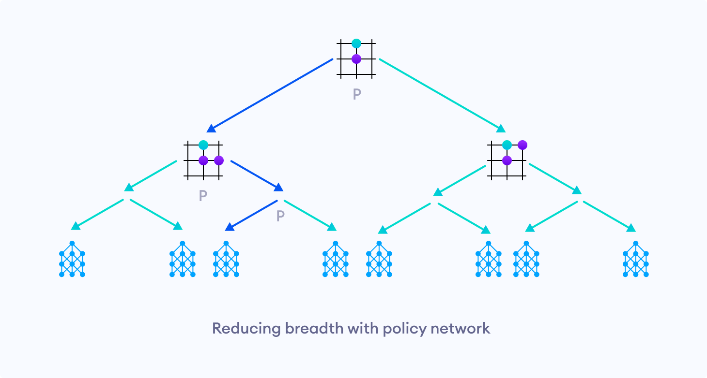<figcaption>The policy network reduces the breadth of tree search by exploring only few promising moves.</figcaption></figure>

Similarly, the value network helps in reducing the depth of the tree search.

<figure>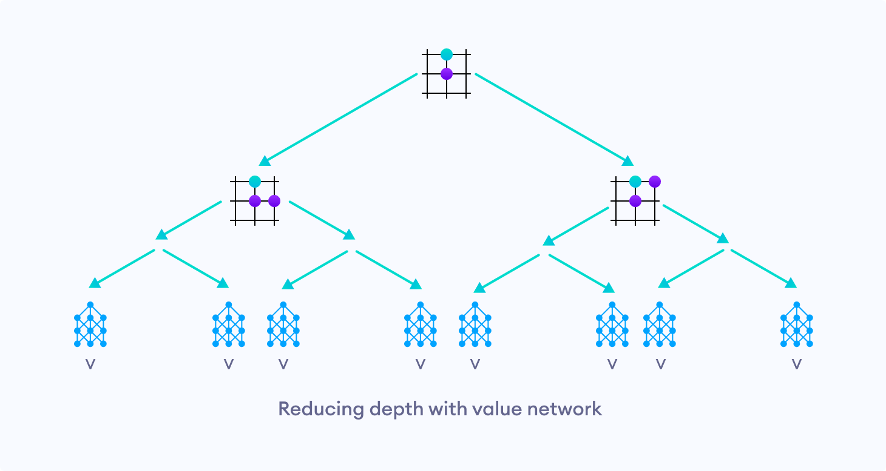<figcaption>The value network reduces the depth of tree search by returning the evaluation of a certain position.</figcaption></figure>

<h3 id="training">Training</h3>

For training, a number of games were played using the neural network employing MCTS and about 50 simulations for each move.

At the end of the game, <strong>1</strong> was awarded for Goat as winner, <strong>-1</strong> was awarded for Tiger as winner and <strong>0</strong> for a draw. For all moves for that game, the value network was then trained to predict this number.

In MCTS, the most promising move is the one that was visited the most. So, the policy network was improved by training it to predict moves in proportion to the number of times the move was made in the simulation.

Similarly, the symmetry of Bagh Chal was used explicitly to populate the training set for each game.

<figure><figcaption>The Bagh Chal game has a rotational and a reflection symmetry.</figcaption></figure>

Here, we can see that one game can produce eight times more training sample games.

<h3 id="compromising-the-tabula-rasa-learning">Compromising the Tabula Rasa Learning</h3>

Although all of this seems to work in theory, I did not experience any improvements in the agent's play even with some training. My speculation is that it might have been caused by the asymmetry of the game. Bagh Chal is an asymmetrical game as each player has different objectives.

If we were to make random moves (similar to the performance of an untrained Neural Network), the probability of Tiger winning the game is larger than the game ending in a draw than Goat winning the game. When the tree search reaches a terminal state favoring a given player very few times, there may not be enough actual game environment rewards for the tree-search to correct any poor network predictions. Thus, the agent gets stuck in a local optimum.

Even though this problem is solved as the model gets trained more and more, I had to find other solutions due to hardware limitations.

I eventually decided to use a greedy heuristic in the training pipeline by initially training the agent on games generated by minimax algorithm with alpha-beta pruning on depth 4.

<h3 id="results">Results</h3>

After training the agent for some time, first greedily on minimax generated games and then by making it play against itself, the agent learns to pick up on the strategies that humans use in their own games. One of the strategies is to always occupy the board corners as the Goat player and maintain distance between the Tiger pieces as the Tiger player.

This trained agent was then used to play games against itself, where most of the games ended in a draw. This result was consistent with the prior study that proves the game as a draw under optimal play. About 10 percent of the time, however, the Goat player was able to snatch victory.

Though this Bagh Chal AI agent punishes even slight inaccuracies by human players, it is by no means perfect. Occasionally, when the agent played as Goat against human players, it made absurd sacrifices over and over again. This represents gaps in the learning domain of the agent. It means that the agent reached positions that it had never explored during its training, and hence had no clue about certain positions.

The AI agent could have been further improved by:

<ol><li>More Experimenting with the hyperparameters of the neural network (Network structure)</li><li>Using two separate networks for Goats and Tigers</li><li>Tabula Rasa Learning</li><li>More training</li></ol>

If you want to learn more about the project and play around with its code, you can find one early prototype of this project in the <a target="_blank" href="https://github.com/basnetsoyuj/AlphaBaghChal">GitHub AlphaBaghChal Repository</a>.

<h2 id="final-words">Final Words</h2>

Even though the agent is not **_Alpha_** by any means, the ultimate joy of being crushed by your own creation is second to none.

One key takeaway from this blog is that the performance of the Artificial Intelligence project boils down to finding the right set of data to train on and choosing the correct hyperparameters to get an optimal learning process.

As the potential of Artificial Intelligence continues to grow by the day, its scope has also broadened to encompass many other fields. Even if you are new to Artificial Intelligence or programming in general, you definitely won't regret keeping up with the field of AI.

Below are some resources that will help you stay up-to-date with the recent developments in AI:
<ol><li><a target="_blank" href="https://ai.googleblog.com/">Google AI Blog</a></li><li><a target="_blank" href="https://www.youtube.com/user/keeroyz">Two Minute Papers</a></li><li><a target="_blank" href="https://www.aitrends.com/">AI Trends</a></li></ol>
Below are some online resources to play around with interesting AI models:
<ol><li><a target="_blank" href="http://nvidia-research-mingyuliu.com/gaugan">NVIDIA GAUGAN</a></li><li><a target="_blank" href="https://playground.tensorflow.org/">Tensorflow Neural Network Playground</a></li><li><a target="_blank" href="https://teachablemachine.withgoogle.com/">Teachable Machine</a></li><li><a target="_blank" href="https://poloclub.github.io/cnn-explainer/">CNN Explainer</a></li><li><a target="_blank" href="https://quickdraw.withgoogle.com/">Quick, DRAW!</a></li></ol>

---

>This blog was posted on the Programiz Blog on July 03, 2020 and can be viewed online at:
[Mastering the Nepali Board Game of Bagh Chal with self-learning AI](https://www.programiz.com/blog/mastering-bagh-chal-with-self-learning-ai)