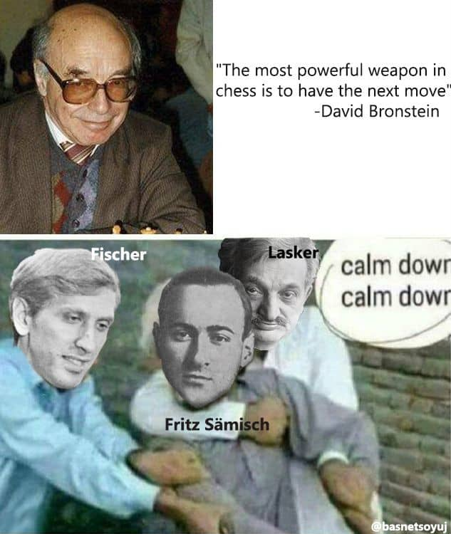

**Zugzwang** is a german word that roughly translates to **_being forced to make a move_**. It is frequently used in association with board games, most notably chess. It is pronounced as **/ˈtsuːktsvaŋ/**.

Unlike in other board games such as Go, the players in chess do not have the option to pass their current move and stay idle. So, a board position can arise during the game where a certain player would prefer to pass the move, but cannot do so. In this case, any move that the player makes will degrade the position of the player in some way or the other.

The first known use of the term in English was by World Chess Champion Emanuel Lasker in 1905.

The sections below assume that you're familiar with the rules of Chess. If you do not know the rules of chess, visit <a href="https://www.chess.com/learn-how-to-play-chess" target="_blank">How To Play Chess.</a>

Positions with zugzwang occur fairly often in chess endgames, especially in king and pawn endgames. Let's look at the simplest zugzwang position that can occur in the endgame phase of chess.

<iframe id="6883540" allowtransparency="true" frameborder="0" height="400" width="603" style="width:100%;border:none;" src="//www.chess.com/emboard?id=6883540"></iframe>

In this situation, white would love to skip a move and keep things as they are. Unfortunately, the rules of chess dictate that you must move, so your only option is to fall on your own sword.

This simple zugzwang position might not have impressed you to the core. There are, however, many complex zugzwang positions that are very visually appealing. Let's look at one such case.

Try out the following puzzle and put black in zugzwang. **_Beauty is more appreciated when one self-disovers it._**

> Look out for non-intuitive and forceful moves.

<iframe allowtransparency="true" border="0" frameborder="0" height="400" width="603" src="//www.chess.com/emboard?id=6206920"></iframe>

Complex Zugzwang positions are very rare in professional level chess and are believed to occur once in a lifetime for a player.

Now, let’s look at a famous game: **_Fritz Sämisch versus Aron Nimzowitsch_**, Copenhagen 1923. The game is often regarded as **The Immortal Zugzwang Game**.

<iframe allowtransparency="true" border="0" frameborder="0" height="465" width="603" src="//www.chess.com/emboard?id=6206922"></iframe>

Here is a Zugzwang meme I couldn’t hold back.

**AlphaZero** — the quintessential deep reinforcement learning agent by _Google DeepMind_ — also created a Zugzwang against the popular classical chess engine Stockfish. The exact zugzwang occurs at **51. g4** !

<iframe id="game" allowtransparency="true" border="0" frameborder="0" height="465" width="603" src="//www.chess.com/emboard?id=6207034"></iframe>

The following video by agadmator's Chess Channel also covers the game move-by-move. Be sure to check it out if you want to understand how the entire game unfolded.

<iframe width="560" height="315" src="https://www.youtube.com/embed/lFXJWPhDsSY" frameborder="0" allow="accelerometer; autoplay; encrypted-media; gyroscope; picture-in-picture" allowfullscreen></iframe>

Zugzwang is an element of art found in the game of chess. AlphaZero’s refutation to Stockfish’s style of play and games like these have rejuvenated the human-like element in the game. It proves that high-level chess doesn’t have to be boring and unaesthetic for the human-mind.

At this point, your brain must be itching to solve some more Zugzwang puzzles. Here’s one more puzzle I will leave at your disposal.

<iframe allowtransparency="true" border="0" frameborder="0" height="465" width="603" src="//www.chess.com/emboard?id=6207076"></iframe>

Make sure you zugzwang your way to victory, being devious and merciless whenever you can.